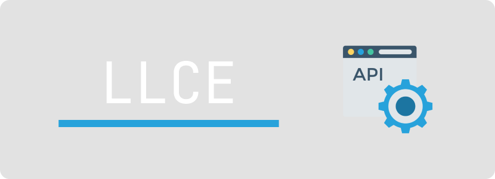

## Leeroy Library Catalog Emulator (LLCE)

## Что это?
Данное приложение эмулирует библиотечный каталог, на котором можно упражняться в написании тестов для API.

Это как Postman Echo, но с дополнительными бенефитами. 

## Что оно умеет?

Приложение содержит такой функционал как:
- Авторизация пользователя
- Предоставление библиотечного каталога
- Предоставление информации по отдельной книге

## Какие у LLCE преимущества перед публичными тестовыми API?

Вкратце: публичные API не предоставляют доступ к БД приложения и, как правило, не умеют эмулировать ошибки. 

Так как LLCE запускается на вашей инфраструктуре, то у вас есть возможность попробовать написать тесты на перекрёстную валидацию данных между API и БД, а также отработать стадии подготовки и уборки тестовых данных при помощи прямого обращения к БД из тестового фреймворка.

Также приложение имеет режим "работы с ошибками": при передаче специального флага приложение начинает нарушать собственные требования, что позволяет убедиться в том, что ваши тесты достаточно хорошо отлавливают отклонения от требований. 

----
### Копирайт

Автор иконки, используемой на баннере: [DinosoftLabs (flaticon.com)](https://www.flaticon.com/free-icon/browser_718064).